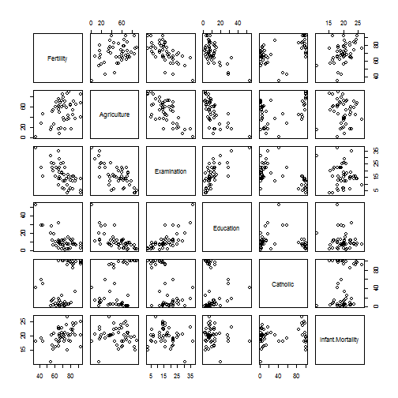
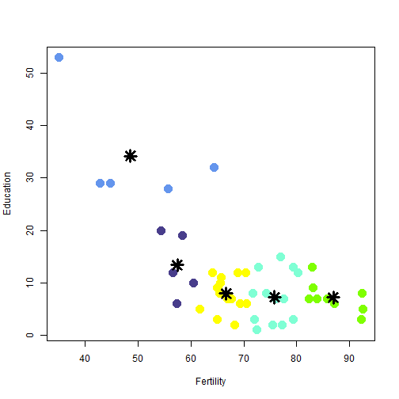

##  Used data
- This application used data with standardized fertility measure and socio-economic indicators for each of 47
French-speaking provinces of Switzerland at about 1888.
 

--- .class #id 

## Variables description

        
- Fertility: common standardized fertility measure
- Agriculture % of males involved in agriculture as occupation
- Examination % draftees receiving highest mark on army examination
- Education % education beyond primary school for draftees.
- Catholic % catholic (as opposed to protestant).
- Infant.Mortality live births who live less than 1 year.

--- .class #id 

## Functionality

This application allows you to analyze how this indicators are related with detection of claster groups: 

1. Please select in app two indicators and see how they are related

2. Please Please select a number of clusters that you want to select the data

--- .class #id 

## Example 
Let's set indicators: Fertility, Education and number of clusters = 5.
 

